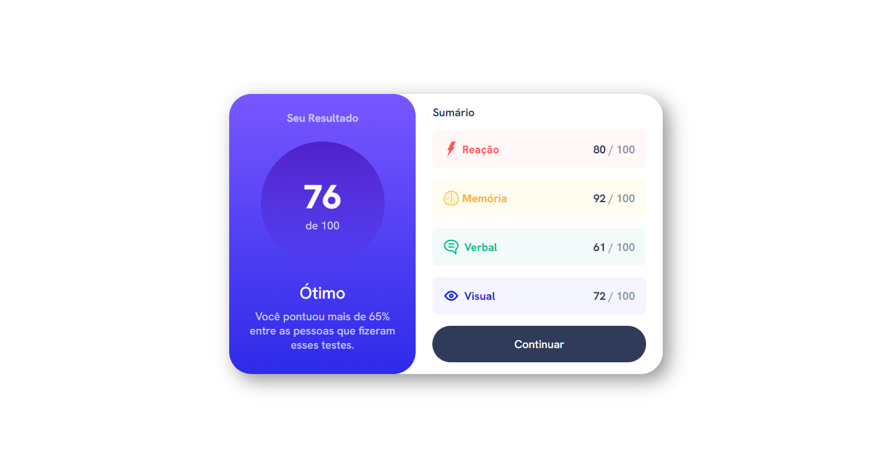

# front-end-mentor-praticando
Praticando meus conhecimentos no front-end mentor.

* [1º Desafio do FrontEnd Mentor.](https://nicolas-felsi.github.io/front-end-mentor-praticando/results-summary-component/)

* [2º Desafio do FrontEnd Mentor.](https://nicolas-felsi.github.io/front-end-mentor-praticando/product-preview-card-component-main/)

